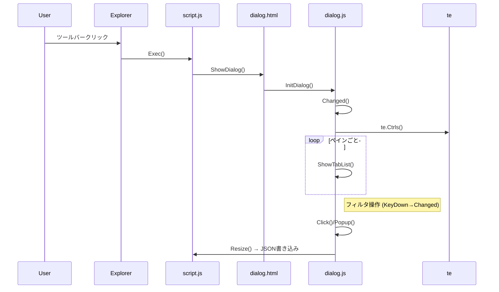

# 詳細設計書

## 1. ファイル別詳細

| ファイル      | 関数／オブジェクト       | 引数          | 戻り値  | 責務                                  |
| :------------ | :----------------------- | :------------ | :------ | :------------------------------------ |
| `config.xml`  | ―                        | ―             | ―       | アドオンメタ情報 (Name/Version)       |
| `script.js`   | `Exec(Ctrl, pt)`         | `Ctrl`, `pt`  | ―       | ダイアログ開閉制御                    |
|               | `Update()`               | ―             | `bool`  | 再描画命令                            |
|               | `ChangeView()`           | ―             | ―       | レイアウト変更検知                    |
| `dialog.js`   | `Changed()`              | ―             | ―       | 一覧再生成トリガ                      |
|               | `ShowTabList(TC, table)` | `TC`, `table` | ―       | タブ行描画                            |
|               | `Click(ev)`              | `ev`          | ―       | タブ切替                              |
|               | `Popup(ev)`              | `ev`          | `false` | コンテキストメニュー                  |
|               | `KeyDown(ev)`            | `ev`          | `bool`  | フィルタ再描画                        |
|               | `Resize()`               | ―             | ―       | サイズ・位置記憶                      |
| `dialog.html` | ―                        | ―             | ―       | UI 要素定義 (`input#filter`, `div#P`) |

## 2. 主要処理シーケンス

